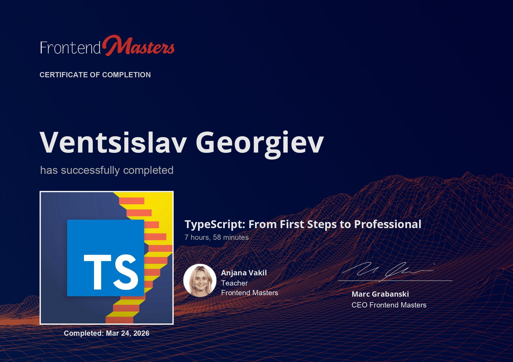

# TypeScript: From First Steps to Professional

This folder contains my work for the Frontend Masters course [TypeScript: From First Steps to Professional](https://frontendmasters.com/courses/typescript-first-steps/).

- Instructor: Anjana Vakil
- Platform: Frontend Masters

## Course Overview

Learn how to move from JavaScript to TypeScript while building real projects that highlight the power of static typing. Add type annotations, interfaces, and generics to write safer, more predictable code. Configure the TypeScript compiler, reuse types across files, and convert both client and server code to TypeScript to add type safety across your entire codebase.

## What This Course Covers

- TypeScript fundamentals and type annotations
- Working with arrays, objects, unions, and narrowing
- Migrating JavaScript files to TypeScript
- Configuring the TypeScript compiler with `tsconfig.json`
- Reusing types with aliases and interfaces
- Generics and utility types
- Applying TypeScript across frontend and backend code

## Certificate

[View certificate](./certificate/from-first-steps-to-profesional-certificate.jpg)

