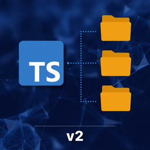
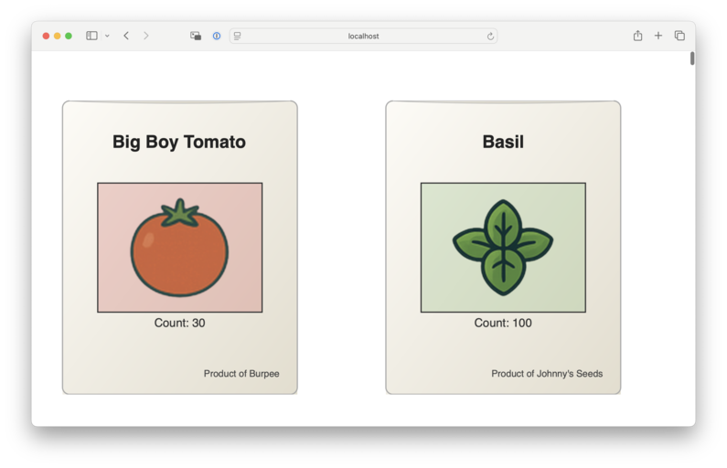

A monorepo is the concept of **many software packages being stored in the same SCM repository**. There are several key benfits

* Monorepo dependencies are _always on latest_.
* Atomic multi-package code changes
* Simpler external dependency
* Upstream changes validated against downstream test suites

In this course, we'll refactor a small client/server app into monorepo. By the end, we'll have

* Monorepo dependencies automatically linked
* Parallized dependency-aware task execution for build, linting and testing
* Commands for CI that run tests on _only the code affected by the change_
* Support for _some_ packages in the monorepo being more coupled with each other than others, by design (e.g. using _private_ functionality)
* Automatic code documentation

We're going to be using some of the latest and greatest tooling, including

* `pnpm`
* `lerna` v7
* `nx` for distributed caching
* `api-extractor` for `.d.ts` rollups
* `api-documenter` for auto-generated docs
* GitHub `CODEOWNERS` to control who should review which parts of the monorepo?
* `changesets` for unified changelogs
* `manypkg` for detecting common pitfalls in `package.json`s across your monorepo
* `syncpack` (or an equivalent `nx` tool) to rally your monorepo around a single version of each dependency
* ...and more!!!

## Project setup

### 1. Make sure you have [`pnpm`](https://pnpm.io/) installed

If you don't using `volta` (get it at [https://volta.sh](https://volta.sh)) is a great way to obtain it.

First, install volta

```sh
curl https://get.volta.sh | bash
```

You may need to close and reopen your terminal before your can verify that your environment has volta installed

```sh
volta --version
> 2.0.2 
```

Then you can run

```sh
volta install pnpm
```

And you should be good to go. Alternatively you can follow [`pnpm`'s direct installation instructions](https://pnpm.io/installation)

### 2. Check out the git repo

```sh
git clone git@github.com:mike-north/ts-monorepos-v2
```

### 3. Install dependencies

```sh
cd ts-monorepos-v2  # Enter the project folder
pnpm install        # Install dependencies
```

### 4. Test whether basic tasks work

```sh
pnpm run build      # Build the project
pnpm run lint       # Lint the project
pnpm run test       # Test the project
```

### 5. Test whether the `dev` script works

```sh
pnpm run dev
```

* You should be able to go to <http://localhost:3000/api/seeds> in a browser and see some JSON
* You should be able to go to <http://localhost:5173/> and see a UI that looks like this


